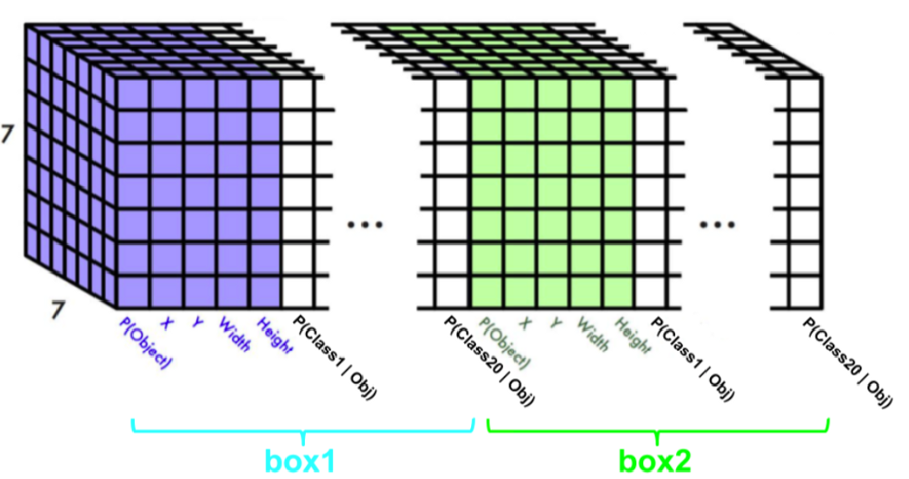

#  YOLO Tensorflow

### 1. Introduction

This is my implementation of YOLO in Tensorflow. I built this mainly for learning purposes and experimentation.
Nevertheless, the project consists of a full end to end pipeline from raw VOC annotated data, all the way to training and evaluating the detection model. The two key features are:

- Scalable tf.data pipeline
- Customizable training, evaluation, and testing scripts

 
Further down, I explain what exactly I have implemented.  
(note: The exact YOLO version implemented is a mixture of v2 and v3)  

Original Paper Links: [YOLOv1](https://arxiv.org/abs/1506.02640) , [YOLOv2](https://arxiv.org/abs/1612.08242) , [YOLOv3](https://arxiv.org/abs/1804.02767)

### 2. Summary

The diagram below is a summary of what my implementation does.

### 3. Code Structure Overview

The folder structure looks as follows (Some folders left out):
<pre>
root
│
├───YOLO
│   ├───data
│   │   ├───files
│   │   └───TFRecords
│   ├───src
│   │   ├───classes
│   │   ├───helper_functions
│   │   ├───scripts
│   │   └───training
│   └───tests
└───model_checkpoints
</pre>

The more detailed source code file structure looks as follows (Some folders and files left out):

<pre>
root
│
├───YOLO
│   ├───data
│   │   ├───files
│   │   ├───TFRecords
│   │   ├───train_file_names.txt
│   │   ├───val_file_names.txt
│   │   └───voc_to_yolo.py
│   ├───src
│   │   ├───classes
│   │   │   ├───LabelTensor.py
│   │   │   ├───Losses.py
│   │   │   ├───Metrics.py
│   │   │   └───ObjectAnnotations.py
│   │   ├───helper_functions
│   │   │   ├───annotation_type_conversions.py
│   │   │   ├───iou.py
│   │   │   ├───model_output_utils.py
│   │   │   └───load_TFRecords.py
│   │   ├───scripts
│   │   │   └───create_TFRecords.py
│   │   └───training
│   │       └───train.ipynb
│   ├───tests
│   │   ├───PipelineVerification.ipynb
│   │   ├───PredictImage.ipynb
│   │   └───WebcamRealTime.ipynb
│   └───GlobalValues.py (Settings file for entire system)
└───model_checkpoints (Tensorboard logs and model save files)
</pre>

### 4. Project Explanation

To best summarize what I have implemented, the below guide quickly runs you through a typical usage of the system.

The file GlobalValues.py acts as the config file for the system. In it you have settings for customizing the loss, the preprocessing, and the anchor boxes, and you also define information of your custom dataset such as class names.

##### 4.1 Data
A ) Collect a dataset where the object annotations are in PASCAL VOC format and the images are jpg files. Place all jpg and xml files into the YOLO/data/files directory.

B ) Create a txt file for each split of your dataset where each line in the txt file is the name (without .filetype suffix) of an image/xml. This way the system knows which files belong into train, validation and test splits. Place these txt files into the YOLO/data directory

##### 4.2 Data Preparation

A ) In GlobalValues.py, specify the names of your classes. Navigate into the data directory and run voc_to_yolo.py. This simply creates a txt file for each xml file where the annotations are now in the YOLO format [class_id x_center y_center width height] with the coordinate values normalized to lie between 0 and 1.

(note: In YOLO systems, image annotations are encoded into label tensors as shown in the following image. This is what the system is trained to output. The number of boxes/anchor-boxes and the size of the grid can be adjusted in GlobalValues.py)

B ) For each image, this step transforms it's annotations into a label Tensor. It then encodes all images and their label tensors into a 10-sharded TFRecord file. Repeat this step for each dataset split: In GlobalValues.py specify the name of the previosuly created txt file you want to use. Then, from the root directory, run YOLO/src/scripts/create_TFRecords.py

##### 4.3 Data Input Pipeline and Training

To load the data for training, the helper function get_dataset() in YOLO/src/helper_functions/load_TFRecords.py can be used. The function also resizes, scales, partially augments and batches the images.  

The tf.data.Dataset returned does not eagerly load and process all the data, but is instead defined to dynamically load and process batches on the fly during training-time. This way, we ensure scalability of our input pipeline.

A ) Finally, open the notebook train.ipynb. It loads the data as described above. You can define and customize your model architecture as long as the architecture's output tensor matches the desired shape defined earlier. Currently, I use the Keras functional API for this, but any Tensorflow code can be used. The model aims to minimize the YOLO loss functions implemented in YOLO/src/classes/Losses.py  
To start training, simply run the cells and observe the metrics printed by keras' model.fit()

##### 4.4 Saving, Loading, and Using the Model

In order to make sense of the output tensors, YOLO/src/helper_functions/model_output_utils.py provides functions to extract bounding boxes from the output tensors in VOC format and apply Non-Max Suppression.

The model's weights are saved in model_checkpoints/ after every training epoch unless the val_loss does not decrease.

To use the model, simply load it using it's checkpoint file, and extract the bounding boxes from the network's output using the given function.

### 5. TODO

[_] Keras Metric that computes the mAP after every epoch.  
[_] More extensive data augmentation options such as flips and crops.  
[_] Multi-Scale Learning.  
[_] Multi-Scale output as in YOLOv3

### 6. Requirements

Python version 3 and tensorflow >= 2.2.0 (currently nightly)

### 7. Closing Words

Due to currently not having access to a GPU, I am unable to train these models to the end. Because of that I can unfortunately not show performance results and demos at this time.
